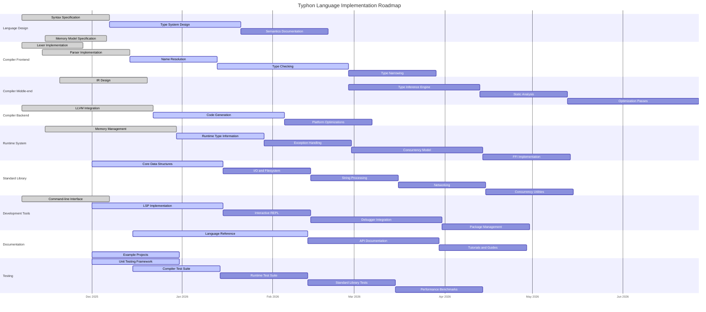

This file tracks the project's progress using a task list format.

## Project Roadmap Diagram

## Completed Tasks

- Initialize Memory Bank
- Language specification
- Compiler architecture design
- LSP implementation plan
- Project structure setup
- Fixed LLVM API incompatibilities in backend/codegen.rs
- Fixed BasicValueEnum type handling for pointer operations
- Fixed Type enum variant mismatches in backend/codegen.rs
- Fixed LLVM PassManager API changes in backend/llvm.rs
- Fixed SourceInfo type mismatches between token and AST modules
- Fixed Type system mismatches in typesystem/checker.rs
- Fixed AST structure mismatches with Statement enum variants
- Fixed binding modifier issues in ast/visitor.rs
- Cleaned up unused imports and variables
- Redesigned memory management model in backend code
- Fixed lifetime issues in backend/codegen.rs and backend/llvm.rs
- Implemented Arc<Mutex<>> based architecture for LLVM context access
- Added support for Python-style True/False/None keywords as dedicated tokens
- Refactored dependency management using workspace dependencies
- Updated project configuration for consistent file indentation
- Fixed typhon-cli build errors:
  - Added VERSION constant to typhon-compiler/src/lib.rs
  - Fixed LLVMContext instantiation with correct argument count
  - Resolved LLVMContext type mismatch using Box::leak for lifetime management

## Current Tasks

- Ensuring comprehensive test coverage for fixed components

## Next Steps

- Complete compiler integration with updated components
- Implement proper error handling throughout the codebase
- Continue with type system implementation
- Complete semantic analysis
- Implement code generation
- Add comprehensive testing
- Implement type narrowing for conditional control flow

2025-11-07 00:00:00 - Initial commit and project creation.
2025-11-07 22:07:00 - Updated with completed LLVM compatibility fixes and current tasks.
2025-11-07 23:10:00 - Updated to reflect completion of all compiler error fixes including lifetime and memory management issues.
2025-11-08 18:55:00 - Updated with boolean literals support, dependency management refactoring, and project configuration improvements.
2025-11-08 21:36:00 - Updated with completed typhon-cli build error fixes including VERSION constant and LLVMContext handling.
2025-11-09 20:30:00 - Updated roadmap diagram to reflect current project progress and added type narrowing.
