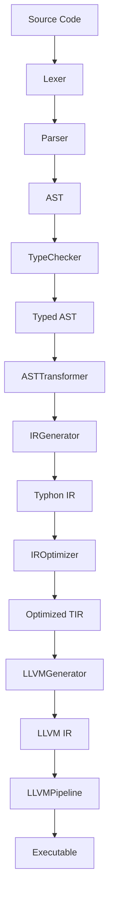
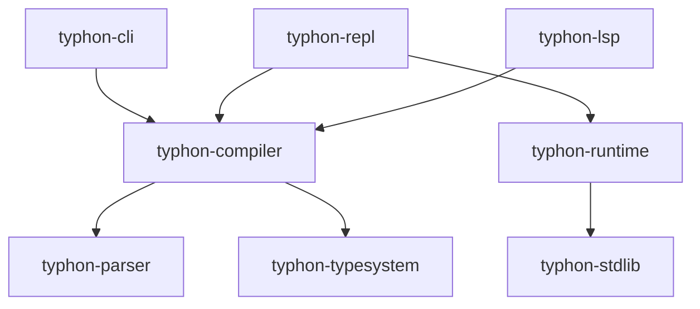

## Table of Contents

- [Table of Contents](#table-of-contents)
- [Project Overview](#project-overview)
- [System Components](#system-components)
- [Architecture Overview](#architecture-overview)
- [Directory Structure](#directory-structure)
- [Core Components](#core-components)
  - [Compiler](#compiler)
  - [Parser](#parser)
  - [Type System](#type-system)
  - [Runtime](#runtime)
  - [Language Server Protocol](#language-server-protocol)
  - [Standard Library](#standard-library)
- [Testing Framework](#testing-framework)
- [Documentation and Resources](#documentation-and-resources)
- [Dependency Analysis](#dependency-analysis)
  - [Component Dependencies](#component-dependencies)
  - [Crate Dependencies](#crate-dependencies)
  - [Module Dependencies](#module-dependencies)

## Project Overview

Typhon is a statically typed programming language based on Python 3 syntax, implemented in Rust with LLVM as the backend. It combines Python's elegant syntax with the benefits of static type checking and compiled performance.

## System Components

The Typhon system consists of these primary components:

1. **Compiler**: Translates Typhon source code to executable binaries
2. **Runtime**: Provides memory management, type information, and standard library
3. **Language Server**: Provides IDE integration via LSP
4. **Tools**: REPL, formatter, documentation generator, etc.

## Architecture Overview

The compiler follows a traditional pipeline architecture with modifications to support static typing of a Python-derived language:



## Directory Structure

```shell
typhon/
├── crates/
│   ├── typhon-cli/           # Command-line interface
│   ├── typhon-compiler/      # Core compiler components
│   │   └── src/
│   │       ├── backend/      # LLVM IR generation, code generation
│   │       └── typesystem/   # Type checking and inference
│   ├── typhon-lsp/           # Language Server Protocol implementation
│   ├── typhon-parser/        # Lexer, parser, AST
│   ├── typhon-repl/          # Interactive REPL
│   ├── typhon-runtime/       # Runtime support
│   └── typhon-stdlib/        # Standard library
├── docs/                     # Documentation
└── examples/                 # Example code and usage
```

## Core Components

### Compiler

The Typhon compiler is structured into several key components:

- **Driver**: Coordinates the compilation pipeline
- **Backend**: Generates LLVM IR and machine code
  - **Code Generator**: Converts AST to LLVM IR
  - **LLVM Pipeline**: Applies optimizations and generates executables
- **Type System**: Performs type checking and inference

### Parser

The parser is implemented using a recursive descent approach:

- **Lexer**: Tokenizes the source code
- **Parser**: Builds AST from tokens
- **AST**: Represents the structure of the source code

### Type System

The type system provides:

- **Type Representation**: Data structures for various types
- **Type Environment**: Tracks types of identifiers in each scope
- **Type Checker**: Verifies type safety
- **Type Inference**: Reduces the need for explicit annotations

### Runtime

The runtime system includes:

- **Reference Counting**: Primary mechanism for memory management
- **Cycle Detection**: Handles circular references
- **Object Model**: Represents runtime data structures

### Language Server Protocol

The LSP implementation includes:

- **Document Manager**: Tracks the state of open documents
- **Analyzer Engine**: Performs incremental analysis
- **Index Manager**: Maintains cross-document information

### Standard Library

The standard library provides:

- **Built-in Types**: Core types and operations
- **Collections**: Data structure implementations
- **I/O**: File and stream operations
- **Utilities**: Common helper functions

## Testing Framework

The testing approach includes:

- **Unit Tests**: For individual components
- **Integration Tests**: For end-to-end functionality
- **Benchmarks**: For performance testing

## Documentation and Resources

Key documentation includes:

- **API Documentation**: Generated from source code comments
- **Language Manual**: Syntax and semantics documentation
- **Examples**: Sample code demonstrating language features

## Dependency Analysis

### Component Dependencies

Based on analysis of the codebase, here's a visualization of the high-level component dependencies:



### Crate Dependencies

Here's a detailed breakdown of crate-level dependencies:

- **typhon-cli**: Depends on typhon-compiler, typhon-parser
- **typhon-compiler**: Depends on typhon-parser, LLVM (via inkwell)
- **typhon-lsp**: Depends on typhon-compiler, typhon-parser
- **typhon-repl**: Depends on typhon-compiler, typhon-runtime
- **typhon-runtime**: Depends on typhon-stdlib
- **typhon-parser**: No internal project dependencies

### Module Dependencies

Key module-level dependencies:

1. **AST Module Dependencies**:
   - All compiler components depend on the AST definitions from typhon-parser
   - The type checker extensively uses AST structures for analysis
   - Code generator transforms AST to LLVM IR

2. **Lexer/Parser Dependencies**:
   - Parser depends on Lexer for token stream
   - CLI, REPL, and LSP components all use the Parser directly

3. **Backend Dependencies**:
   - Code generator depends on AST and Type System
   - LLVM context is used throughout the backend
