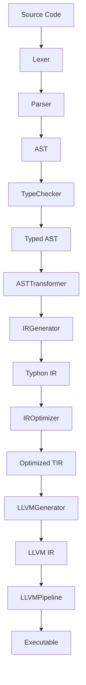
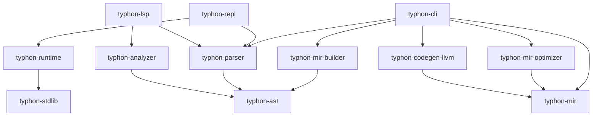

## Table of Contents

- [Table of Contents](#table-of-contents)
- [Project Overview](#project-overview)
- [System Components](#system-components)
- [Architecture Overview](#architecture-overview)
- [Directory Structure](#directory-structure)
- [Core Components](#core-components)
  - [Compiler](#compiler)
  - [Parser](#parser)
  - [Type System](#type-system)
  - [Runtime](#runtime)
  - [Language Server Protocol](#language-server-protocol)
  - [Standard Library](#standard-library)
- [Testing Framework](#testing-framework)
- [Documentation and Resources](#documentation-and-resources)
- [Dependency Analysis](#dependency-analysis)
  - [Component Dependencies](#component-dependencies)
  - [Crate Dependencies](#crate-dependencies)
  - [Module Dependencies](#module-dependencies)

## Project Overview

Typhon is a statically typed programming language based on Python 3 syntax, implemented in Rust with LLVM as the backend. It combines Python's elegant syntax with the benefits of static type checking and compiled performance.

## System Components

The Typhon system consists of these primary components:

1. **Compiler**: Translates Typhon source code to executable binaries
2. **Runtime**: Provides memory management, type information, and standard library
3. **Language Server**: Provides IDE integration via LSP
4. **Tools**: REPL, formatter, documentation generator, etc.

## Architecture Overview

The compiler follows a traditional pipeline architecture with modifications to support static typing of a Python-derived language:


```mermaid
graph TD
    Source[Source Code] --> Lexer
    Lexer --> Parser
    Parser --> AST[AST]
    AST --> TypeChecker
    TypeChecker --> TAST[Typed AST]
    TAST --> ASTTransformer
    ASTTransformer --> IRGenerator
    IRGenerator --> TIR[Typhon IR]
    TIR --> IROptimizer
    IROptimizer --> OptimizedTIR[Optimized TIR]
    OptimizedTIR --> LLVMGenerator
    LLVMGenerator --> LLVMIR[LLVM IR]
    LLVMIR --> LLVMPipeline
    LLVMPipeline --> Executable
```

## Directory Structure

```shell
typhon/
├── crates/
│    ├── typhon-analyzer/      # Semantic analysis infrastructure
│    ├── typhon-ast/           # Abstract Syntax Tree (AST) definitions
│    ├── typhon-cli/           # Command-line interface
│    ├── typhon-codegen-llvm/  # LLVM code generation backend
│    ├── typhon-lsp/           # Language Server Protocol implementation
│    ├── typhon-mir/           # Mid-level Intermediate Representation (MIR)
│    ├── typhon-mir-builder/   # AST to MIR lowering
│    ├── typhon-mir-optimizer/ # MIR optimization passes
│    ├── typhon-parser/        # Lexer, parser
│    ├── typhon-repl/          # Interactive REPL
│    ├── typhon-runtime/       # Runtime support
│    ├── typhon-source/        # Source file handling and position tracking
│    └── typhon-stdlib/        # Standard library
├── docs/                     # Documentation
└── examples/                 # Example code and usage
```

## Core Components

### Compiler

The Typhon compiler is structured into several key components:

- **Driver**: Coordinates the compilation pipeline
- **Backend**: Generates LLVM IR and machine code
  - **Code Generator**: Converts AST to LLVM IR
  - **LLVM Pipeline**: Applies optimizations and generates executables
- **Type System**: Performs type checking and inference

### Parser

The parser is implemented using a recursive descent approach:

- **Lexer**: Tokenizes the source code
- **Parser**: Builds AST from tokens
- **AST**: Represents the structure of the source code

### Type System

The type system provides:

- **Type Representation**: Data structures for various types
- **Type Environment**: Tracks types of identifiers in each scope
- **Type Checker**: Verifies type safety
- **Type Inference**: Reduces the need for explicit annotations

### Runtime

The runtime system includes:

- **Reference Counting**: Primary mechanism for memory management
- **Cycle Detection**: Handles circular references
- **Object Model**: Represents runtime data structures

### Language Server Protocol

The LSP implementation includes:

- **Document Manager**: Tracks the state of open documents
- **Analyzer Engine**: Performs incremental analysis
- **Index Manager**: Maintains cross-document information

### Standard Library

The standard library provides:

- **Built-in Types**: Core types and operations
- **Collections**: Data structure implementations
- **I/O**: File and stream operations
- **Utilities**: Common helper functions

## Testing Framework

The testing approach includes:

- **Unit Tests**: For individual components
- **Integration Tests**: For end-to-end functionality
- **Benchmarks**: For performance testing

## Documentation and Resources

Key documentation includes:

- **API Documentation**: Generated from source code comments
- **Language Manual**: Syntax and semantics documentation
- **Examples**: Sample code demonstrating language features

## Dependency Analysis

### Component Dependencies

Here's a visualization of the high-level component dependencies:


```mermaid
graph TD
    CLI[typhon-cli] --> Parser[typhon-parser]
    CLI --> MIR[typhon-mir]
    CLI --> MIRBuilder[typhon-mir-builder]
    CLI --> MIROptimizer[typhon-mir-optimizer]
    CLI --> CodeGenLLVM[typhon-codegen-llvm]
    REPL[typhon-repl] --> Parser
    REPL --> Runtime[typhon-runtime]
    LSP[typhon-lsp] --> Parser
    LSP --> Analyzer[typhon-analyzer]
    Runtime --> StdLib[typhon-stdlib]
    MIRBuilder --> AST[typhon-ast]
    Parser --> AST
    Analyzer --> AST
    MIROptimizer --> MIR
    CodeGenLLVM --> MIR
```

### Crate Dependencies

Here's a detailed breakdown of crate-level dependencies:

- **typhon-cli**: Depends on typhon-parser, typhon-mir, typhon-mir-builder, typhon-mir-optimizer, typhon-codegen-llvm
- **typhon-codegen-llvm**: Depends on typhon-mir, LLVM (via inkwell)
- **typhon-lsp**: Depends on typhon-parser, typhon-analyzer, typhon-ast
- **typhon-repl**: Depends on typhon-parser, typhon-runtime
- **typhon-runtime**: Depends on typhon-stdlib
- **typhon-parser**: Depends on typhon-ast
- **typhon-analyzer**: Depends on typhon-ast
- **typhon-mir-builder**: Depends on typhon-ast, typhon-mir
- **typhon-mir-optimizer**: Depends on typhon-mir

### Module Dependencies

Key module-level dependencies:

1. **AST Module Dependencies**:
   - The AST crate defines core structures used throughout the project
   - Parser produces AST nodes from source code
   - Analyzer uses AST structures for semantic analysis
   - MIR-builder transforms AST to MIR

2. **Lexer/Parser Dependencies**:
   - Parser depends on Lexer for token stream
   - CLI, REPL, and LSP components all use the Parser directly
   - Source handling provides position information for diagnostics

3. **Backend Dependencies**:
   - MIR is the core intermediate representation
   - MIR-optimizer applies transformation passes to the MIR
   - Codegen-LLVM transforms MIR to LLVM IR for final code generation
   - LLVM context is used throughout the backend
