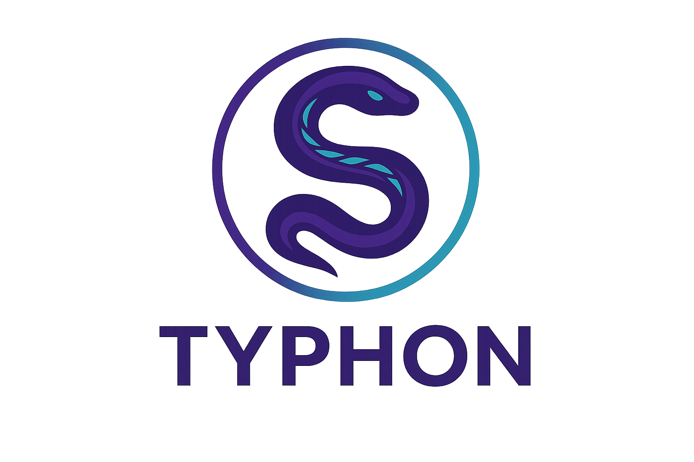

# 

> [!NOTE]
> **⚠️ Project Status: Alpha/Experimental**
>
> Typhon is in early development. Core components like the lexer, parser, and LLVM integration are functional, but many features including code generation, concurrency model, and most of the standard library are not yet implemented.

Typhon is a statically typed programming language based on Python 3, implemented in Rust with LLVM as the backend.

## Similarities and Differences with Python

Typhon maintains Python's clean, readable syntax while introducing static typing and performance optimizations:

### Similarities

- **Familiar Syntax**: Pythonic code structure with significant whitespace and clean readability
- **Core Data Structures**: Lists, dictionaries, tuples, and sets work similarly to Python
- **Object-Oriented Features**: Classes, inheritance, and polymorphism follow Python paradigms
- **Module System**: Compatible import system for code organization

### Differences

- **Static Typing**: Enforces type safety at compile-time rather than runtime
- **Type Narrowing**: Automatically refines types in conditional contexts for better safety and expressiveness
- **Memory Management**: Hybrid approach with reference counting, cycle detection, and escape analysis
- **Compilation**: Compiles to native code via LLVM rather than interpreted bytecode
- **Performance Optimizations**: Type-specific optimizations not possible in dynamic Python
- **Enhanced Error Detection**: Catches type errors before execution rather than at runtime

## Why Typhon?

Python has become ubiquitous in fields like data science, web development, and systems automation due to its readability and flexibility. Developers universally praise Python's clean syntax and expressive power, making it one of the most beloved programming languages. However, as projects grow in size and complexity, Python's dynamic typing can lead to runtime errors, reduced maintainability, and performance limitations. Typhon addresses these challenges by bringing static typing and compilation to Python's elegant syntax.

## Benefits of Typhon Over Python

1. **Enhanced Type Safety**: Catch errors at compile time rather than runtime, reducing production bugs
2. **Improved Performance**: Native code generation via LLVM provides significant speed improvements over interpreted Python
3. **Better Tooling Support**: Static typing enables more powerful IDE features like accurate code completion and refactoring
4. **Maintainability at Scale**: Type definitions serve as living documentation and help manage large codebases
5. **Incremental Adoption**: Designed to allow gradual migration from Python, with syntax compatibility and gradual typing support
6. **Memory Efficiency**: More precise memory management reduces overhead compared to Python's dynamic approach
7. **Specialized Optimizations**: Type information allows the compiler to apply optimizations impossible in a dynamic language
8. **No Interpreter Required**: Compiled executables run without requiring a Python installation, simplifying deployment
9. **Beginner-Friendly**: Maintains Python's gentle learning curve that makes it ideal for first-time programmers
10. **Developer Experience**: Preserves the clean, expressive syntax that developers love about Python while adding compile-time safety

## Code Example

Here's a side-by-side comparison showing how Typhon adds static typing to familiar Python syntax:

**Python:**

```python
def calculate_average(numbers):
    total = sum(numbers)
    return total / len(numbers)

result = calculate_average([1, 2, 3, 4, 5])
print(f"The average is {result}")
```

**Typhon:**

```python
def calculate_average(numbers: list[int]) -> float:
    total: int = sum(numbers)
    return total / len(numbers)

result: float = calculate_average([1, 2, 3, 4, 5])
print(f"The average is {result}")
```

## Getting Started

### Prerequisites

- Rust toolchain (rustc, cargo)
- LLVM 18.1.8 or compatible version
- Git

### Building from Source

1. Clone the repository:

   ```bash
   git clone https://github.com/typhon-dev/typhon.git
   cd typhon
   ```

2. Build the project:

   ```bash
   cargo build
   ```

3. Run the tests:

   ```bash
   cargo test
   ```

4. Try the examples:

   ```bash
   cargo run --bin typhon-cli -- examples/hello.ty
   ```

## Contributing

Contributions are welcome! Typhon is in early development and there are many areas where help is needed.

Please see [CONTRIBUTING.md](CONTRIBUTING.md) for guidelines on how to contribute to the project.

## License

Typhon is licensed under the MIT License - see the [LICENSE](LICENSE) file for details.

## Community and Support

- **GitHub Issues**: For bug reports and feature requests
- **Discussions**: For questions and community discussions
- **Discord**: TBD <!-- Join our [Discord server](https://discord.gg/typhon) for real-time chat -->
- **Twitter**: TBD <!-- Follow [@typhonlang](https://twitter.com/typhonlang) for updates -->

## Project Roadmap

Typhon is under active development with several components already functional and many more planned. The project is organized into major functional areas including language design, compiler implementation, runtime system, standard library, development tools, documentation, and testing infrastructure.

For the complete, detailed project roadmap with current status of all components, see [ROADMAP.md](ROADMAP.md).
