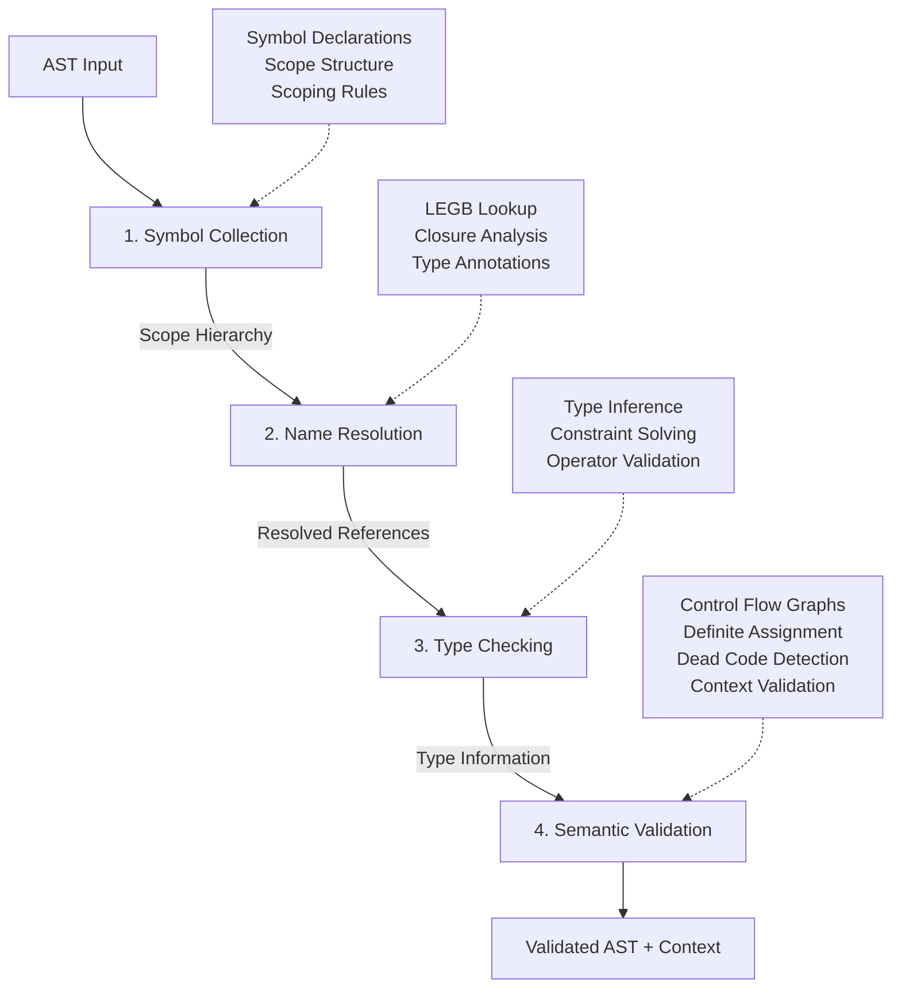

# typhon-analyzer

Semantic analysis infrastructure for the Typhon compiler.

This crate provides symbol table management, type system infrastructure, name resolution, type checking, type inference, and semantic validation used throughout the Typhon compiler pipeline.

## Architecture

The crate is organized into the following modules:

- **`symbol`**: Symbol table implementation with scopes and symbol management
  - `Scope`, `ScopeID`, `ScopeKind`: Scope representation and identification
  - `Symbol`, `SymbolKind`, `SymbolFlags`: Symbol metadata and properties
  - `SymbolTable`: Main symbol table with scope management and name resolution

- **`types`**: Type system infrastructure
  - `Type`: Comprehensive type enum covering all Typhon types
  - `TypeID`: Unique type identifier
  - `TypeEnvironment`: Tracks type information during analysis

- **`error`**: Semantic error types
  - `SemanticError`: Enumeration of all semantic errors with associated data

- **`context`**: Unified semantic analysis context
  - `SemanticContext`: Combines symbol table and type environment

- **`analysis`**: Control flow and dataflow analysis
  - `control_flow`: Control Flow Graph (CFG) construction with basic blocks
  - `definite_assignment`: Forward dataflow analysis tracking variable initialization
  - `dead_code`: Unreachability analysis and unused variable detection

- **`visitors`**: Multi-pass analysis visitors
  - `SymbolCollectorVisitor`: First pass - collects symbol definitions
  - `NameResolverVisitor`: Second pass - resolves references and analyzes closures
  - `TypeCheckerVisitor`: Third pass - performs type checking and inference
  - `SemanticValidatorVisitor`: Fourth pass - validates control flow, definite assignment, and context rules

## Analysis Pipeline

The semantic analysis follows a four-pass architecture:

### Pass 1: Symbol Collection

- Traverses AST collecting all symbol declarations
- Builds hierarchical scope structure
- Handles scoping (hoisting, isolation)

### Pass 2: Name Resolution

- Resolves all identifier references
- Performs LEGB scope chain lookup
- Analyzes closures and variable captures
- Resolves type annotations

### Pass 3: Type Checking

- Infers types for expressions
- Validates operator usage
- Checks function calls and assignments
- Solves type constraints

### Pass 4: Semantic Validation

- Builds control flow graphs
- Analyzes definite assignment
- Detects dead code
- Validates context rules (break/continue/return)
- Validates method/attribute existence
