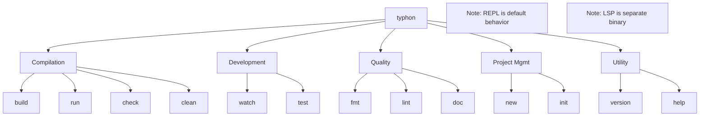

# Typhon CLI

Command-line interface for the Typhon programming language.

This crate provides the `typhon` command-line tool for compiling, running, and managing Typhon projects.

## Table of Contents

- [Typhon CLI](#typhon-cli)
  - [Table of Contents](#table-of-contents)
  - [Architecture](#architecture)
  - [Command Structure Overview](#command-structure-overview)
    - [Top-Level Command](#top-level-command)
    - [Command Categories](#command-categories)
    - [Quick Reference Table](#quick-reference-table)
  - [Detailed Command Specifications](#detailed-command-specifications)
    - [Compilation Commands](#compilation-commands)
      - [`typhon build`](#typhon-build)
      - [`typhon run`](#typhon-run)
      - [`typhon check`](#typhon-check)
      - [`typhon clean`](#typhon-clean)
    - [Development Commands](#development-commands)
      - [`typhon watch`](#typhon-watch)
      - [`typhon test`](#typhon-test)
    - [Quality Commands](#quality-commands)
      - [`typhon fmt`](#typhon-fmt)
      - [`typhon lint`](#typhon-lint)
      - [`typhon doc`](#typhon-doc)
    - [Project Management Commands](#project-management-commands)
      - [`typhon new`](#typhon-new)
      - [`typhon init`](#typhon-init)
    - [Utility Commands](#utility-commands)
      - [`typhon version`](#typhon-version)
      - [`typhon help`](#typhon-help)

## Architecture

The CLI is organized into:

```shell
typhon-cli/
└── src/
    ├── main.rs              # Main entry point with argument parsing and command routing
    └── commands/            # Individual command implementations
        ├── build.rs         # Project building and compilation
        ├── check.rs         # Type checking without code generation
        ├── doc.rs           # Documentation generation
        ├── fmt.rs           # Code formatting
        ├── help.rs          # Help information display
        ├── init.rs          # Initialize project in existing directory
        ├── lint.rs          # Code quality checking
        ├── mod.rs           # Commands module definition
        ├── new.rs           # New project creation
        ├── repl.rs          # REPL integration
        ├── run.rs           # File compilation and execution
        ├── test.rs          # Test suite execution
        ├── version.rs       # Version information display
        └── watch.rs         # File watching and auto-recompilation
```

## Command Structure Overview

### Top-Level Command

```shell
typhon [OPTIONS] [SUBCOMMAND]
typhon [OPTIONS] <FILE>
```

**Default Behavior:**

- `typhon` (no arguments) → Launches interactive REPL
- `typhon <file.ty>` → Shorthand for `typhon run <file.ty>`
- `typhon [subcommand]` → Executes specific command

This mimics Python's behavior where `python3` launches a REPL and `python3 script.py` runs a script.

### Command Categories



### Quick Reference Table

| Command         | Category        | Phase    | Description                         |
| --------------- | --------------- | -------- | ----------------------------------- |
| `build`         | Compilation     | MVP      | Compile to executable               |
| `run`           | Compilation     | MVP      | Compile and run                     |
| `check`         | Compilation     | MVP      | Fast type checking only             |
| `clean`         | Compilation     | Essential| Remove build artifacts              |
| `watch`         | Development     | Essential| Auto-recompile on changes           |
| `test`          | Development     | Essential| Run test suite                      |
| `fmt`           | Quality         | Essential| Format code                         |
| `lint`          | Quality         | Essential| Check code quality                  |
| `doc`           | Quality         | Advanced | Generate documentation              |
| `new`           | Project         | Essential| Create new project                  |
| `init`          | Project         | Essential| Initialize in existing directory    |
| `version`       | Utility         | MVP      | Show version information            |
| `help`          | Utility         | MVP      | Show help                           |

**Notes:**

- REPL is accessed via `typhon` with no arguments (default behavior)
- LSP server is a separate `typhon-lsp` binary

## Detailed Command Specifications

### Compilation Commands

#### `typhon build`

Compile Typhon source files to native executables.

**Syntax:**

```shell
typhon build [OPTIONS] [FILE]
```

**Options:**

```shell
-o, --output <FILE>        Output file path
-O, --opt-level <LEVEL>    Optimization level: 0, 1, 2, 3 [default: 2]
--release                  Build with optimizations (alias for -O 3)
--debug                    Include debug information
--emit-llvm                Emit LLVM IR instead of executable
--target <TRIPLE>          Target triple for cross-compilation
--verbose                  Show detailed compilation progress
--timings                  Show compilation timing breakdown
--jobs <N>                 Number of parallel jobs [default: CPU count]
```

**Examples:**

```shell
# Compile single file
typhon build hello.ty

# Compile with optimizations
typhon build --release main.ty -o myapp

# Emit LLVM IR for inspection
typhon build --emit-llvm program.ty

# Show detailed progress
typhon build --verbose --timings main.ty
```

**Integration Points:**

- `typhon-parser`: Lexing and parsing
- `typhon-analyzer`: Semantic analysis
- `typhon-compiler`: Type checking and LLVM code generation
- `typhon-runtime`: Link runtime library

**Exit Codes:**

- `0`: Success
- `1`: Compilation error
- `2`: Invalid arguments

---

#### `typhon run`

Compile and immediately execute a Typhon program.

**Syntax:**

```shell
typhon run [OPTIONS] <FILE> [-- ARGS]
```

**Options:**

```shell
-O, --opt-level <LEVEL>    Optimization level [default: 0]
--verbose                  Show compilation output
-- <ARGS>                  Arguments passed to program
```

**Examples:**

```shell
# Run a script
typhon run hello.ty

# Run with arguments
typhon run script.ty -- arg1 arg2

# Run with optimizations
typhon run -O 2 benchmark.ty
```

**Behavior:**

- Compiles to temporary executable in system temp directory
- Executes immediately
- Cleans up temporary file on exit
- Fast compilation (opt-level 0 by default) for quick iteration
- Passes through program exit code

**Integration Points:**

- Same as `build`, plus execution handling
- Temporary file management
- Signal handling (Ctrl+C passes to child process)

---

#### `typhon check`

Perform fast type checking without code generation. This is the fastest way to validate code correctness.

**Syntax:**

```shell
typhon check [OPTIONS] [FILES]
```

**Options:**

```shell
--all                      Check all files in project
--strict                   Enable all strict type checking rules
--no-cache                 Disable incremental checking cache
--json                     Output errors in JSON format
--verbose                  Show detailed checking information
```

**Examples:**

```shell
# Check single file
typhon check main.ty

# Check entire project
typhon check --all

# Check with strict rules
typhon check --strict src/

# Machine-readable output
typhon check --json src/ > errors.json
```

**Performance Target:**

- 10-100x faster than full compilation
- Incremental checking with caching
- Parallel checking of independent modules

**Integration Points:**

- `typhon-parser`: Parse to AST
- `typhon-analyzer`: Symbol collection, type checking
- No LLVM code generation (major speedup)

---

#### `typhon clean`

Remove build artifacts and caches.

**Syntax:**

```shell
typhon clean [OPTIONS]
```

**Options:**

```shell
--cache                    Also remove incremental compilation cache
--doc                      Also remove generated documentation
--all                      Remove all generated files
--dry-run                  Show what would be deleted
--verbose                  Show deleted files
```

**Examples:**

```shell
# Remove build artifacts
typhon clean

# Remove everything including cache
typhon clean --all

# Preview without deleting
typhon clean --dry-run
```

**Removes:**

- `target/` or `build/` directory (compiled executables)
- `.typhon_cache/` (incremental compilation cache)
- `target/doc/` (generated documentation, with `--doc`)

---

### Development Commands

**Note on REPL:** The interactive REPL is accessed by running `typhon` without arguments, not as an explicit subcommand. This mimics Python's behavior and provides the most ergonomic experience for interactive exploration.

---

#### `typhon watch`

Automatically recompile or rerun when source files change. Essential for iterative development.

**Syntax:**

```shell
typhon watch [OPTIONS] <COMMAND>
```

**Options:**

```shell
--clear                    Clear screen before each run
--ignore <PATTERN>         Ignore files matching pattern
--watch <PATH>             Additional paths to watch
--delay <MS>               Debounce delay in milliseconds [default: 100]
```

**Examples:**

```shell
# Watch and check
typhon watch check main.ty

# Watch and run
typhon watch run main.ty

# Watch and run tests
typhon watch test

# Clear screen between runs
typhon watch --clear run main.ty
```

**Behavior:**

- Monitors file system for changes
- Debounces rapid successive changes
- Shows clear feedback on each iteration
- Handles errors gracefully (doesn't exit on compilation failure)
- Can be interrupted with Ctrl+C

**Integration Points:**

- File system watcher (e.g., `notify` crate)
- Delegates to specified subcommand (check, run, test, etc.)

#### `typhon test`

Run the project's test suite.

**Syntax:**

```shell
typhon test [OPTIONS] [FILTER]
```

**Options:**

```shell
--verbose                  Show detailed test output
--quiet                    Minimal output
--nocapture                Don't capture test stdout/stderr
--test-threads <N>         Number of parallel test threads
--ignored                  Run ignored tests
--include-ignored          Run both normal and ignored tests
--list                     List all tests without running
--format <FORMAT>          Output format: pretty, terse, json
```

**Examples:**

```shell
# Run all tests
typhon test

# Run specific test
typhon test test_addition

# Run tests matching pattern
typhon test "test_math*"

# Run with detailed output
typhon test --verbose --nocapture

# List available tests
typhon test --list
```

**Test Discovery:**

- Files matching `test_*.ty` or `*_test.ty`
- Functions with `@test` decorator
- Methods with `@test` in test classes

**Integration Points:**

- Test framework (to be designed)
- Parallel test execution
- Test result aggregation

---

### Quality Commands

#### `typhon fmt`

Format Typhon source code according to standard style.

**Syntax:**

```shell
typhon fmt [OPTIONS] [FILES]
```

**Options:**

```shell
--check                    Check if files are formatted without modifying
--diff                     Show formatting differences
--verbose                  Show formatted files
--config <FILE>            Custom formatting configuration
```

**Examples:**

```shell
# Format files in place
typhon fmt src/

# Check formatting in CI
typhon fmt --check src/

# Preview changes
typhon fmt --diff main.ty
```

**Style Guide:**

- 4-space indentation (Python convention)
- Line length: 88 characters (Black standard)
- Trailing commas in multi-line structures
- Configurable via `.typhon-format.toml` or `pyproject.toml`

**Integration Points:**

- Formatter implementation (to be built)
- `typhon-parser`: Parse to AST, preserve semantics
- Pretty-printer for AST

---

#### `typhon lint`

Check code for potential issues beyond type errors.

**Syntax:**

```shell
typhon lint [OPTIONS] [FILES]
```

**Options:**

```shell
--fix                      Automatically fix fixable issues
--allow <RULE>             Allow specific lint rule
--deny <RULE>              Treat warning as error
--config <FILE>            Custom lint configuration
--list-rules               List all available rules
```

**Examples:**

```shell
# Lint project
typhon lint src/

# Show all rules
typhon lint --list-rules

# Auto-fix issues
typhon lint --fix src/

# Deny specific warnings
typhon lint --deny unused-import src/
```

**Lint Rules (Examples):**

- `unused-import`: Unused imports
- `unused-variable`: Unused local variables
- `dead-code`: Unreachable code
- `complexity`: Function too complex
- `naming-convention`: Naming style violations
- `missing-docstring`: Missing documentation
- `redundant-cast`: Unnecessary type casts

**Integration Points:**

- `typhon-analyzer`: Semantic analysis
- Lint rule engine (to be built)
- AST pattern matching

---

#### `typhon doc`

Generate documentation from source code and docstrings.

**Syntax:**

```shell
typhon doc [OPTIONS]
```

**Options:**

```shell
--open                     Open generated docs in browser
--output <DIR>             Output directory [default: target/doc]
--format <FORMAT>          Output format: html, markdown [default: html]
--private                  Include private items
--no-deps                  Don't document dependencies
```

**Examples:**

```shell
# Generate docs
typhon doc

# Generate and open
typhon doc --open

# Include private items
typhon doc --private
```

**Documentation Format:**

- Python-style docstrings (Google, NumPy, or Sphinx format)
- Type signatures from annotations
- Examples from docstrings

**Integration Points:**

- `typhon-parser`: Extract docstrings
- `typhon-analyzer`: Type information
- Documentation generator (to be built)

---

### Project Management Commands

#### `typhon new`

Create a new Typhon project with standard structure.

**Syntax:**

```shell
typhon new [OPTIONS] <NAME>
```

**Options:**

```shell
--bin                      Create a binary project [default]
--lib                      Create a library project
--vcs <VCS>                Version control: git, none [default: git]
--name <NAME>              Set package name (defaults to directory name)
```

**Examples:**

```shell
# Create binary project
typhon new myapp

# Create library
typhon new --lib mylib

# Without git
typhon new --vcs none project
```

**Generated Structure (Binary):**

```shell
myapp/
├── typhon.toml           # Project manifest
├── .gitignore
├── README.md
└── src/
    └── main.ty           # Entry point
```

**Generated Structure (Library):**

```shell
mylib/
├── typhon.toml
├── .gitignore
├── README.md
└── src/
    └── lib.ty            # Library root
```

**Project Manifest (`typhon.toml`):**

```toml
[package]
name = "myapp"
version = "0.1.0"
authors = ["Your Name <you@example.com>"]
edition = "2024"

[dependencies]

[dev-dependencies]
```

**Integration Points:**

- Template system for project scaffolding
- Git initialization (via `git` command or library)

---

#### `typhon init`

Initialize a Typhon project in an existing directory.

**Syntax:**

```shell
typhon init [OPTIONS] [PATH]
```

**Options:**

```shell
--bin                      Create a binary project [default]
--lib                      Create a library project
--name <NAME>              Set package name
```

**Examples:**

```shell
# Initialize in current directory
typhon init

# Initialize in specific directory
typhon init path/to/project

# Initialize as library
typhon init --lib
```

**Behavior:**

- Creates `typhon.toml` if it doesn't exist
- Creates `src/` directory and entry point file
- Does not overwrite existing files
- Works in directories with existing code

---

### Utility Commands

#### `typhon version`

Display version information.

**Syntax:**

```shell
typhon version [OPTIONS]
```

**Options:**

```shell
--verbose                  Show detailed version info
--json                     Output in JSON format
```

**Examples:**

```shell
# Show version
typhon version

# Show detailed info
typhon version --verbose
```

**Output (simple):**

```shell
typhon 0.1.0
```

**Output (verbose):**

```shell
typhon 0.1.0
compiler: 0.1.0
runtime: 0.1.0
llvm: 18.1.8
rustc: 1.75.0
platform: x86_64-unknown-linux-gnu
commit: abc123def456
```

---

#### `typhon help`

Display help information.

**Syntax:**

```shell
typhon help [SUBCOMMAND]
```

**Examples:**

```shell
# General help
typhon help

# Command-specific help
typhon help build
```

**Equivalent to:**

```shell
typhon --help
typhon build --help
```
