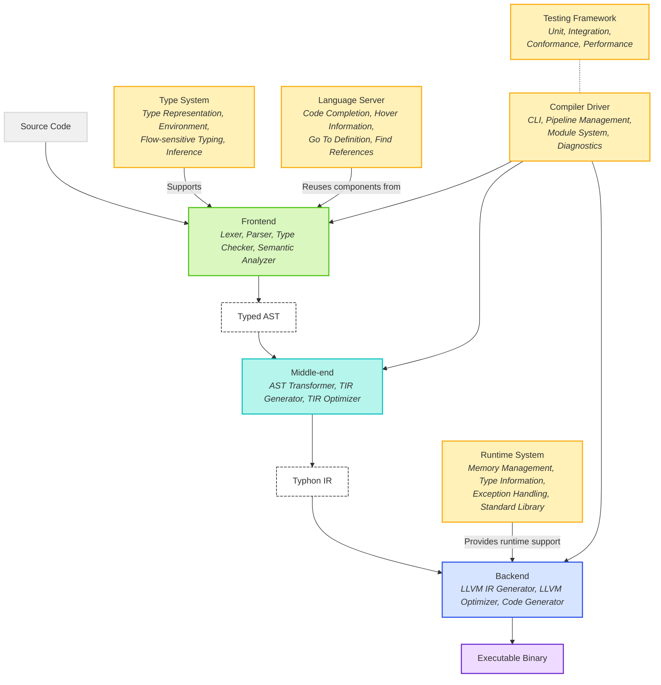

## 1. Introduction

This document outlines the architecture for the Typhon programming language compiler. Typhon is a statically and strongly typed language based on Python 3 syntax, aiming to combine Python's elegant syntax and ease of use with the benefits of static type checking and compiled performance.

### 1.1 Design Goals

The Typhon compiler architecture is designed to achieve the following goals:

- Maintain compatibility with Python 3's syntax and AST structure
- Provide robust static type checking and inference
- Generate efficient machine code via LLVM
- Support incremental and ahead-of-time compilation
- Deliver excellent developer experience through LSP
- Enable gradual migration from Python to Typhon

### 1.2 System Context

The Typhon compiler system consists of:

- **Compiler**: Translates Typhon source code to executable binaries
- **Runtime**: Provides memory management, type information, and standard library
- **Language Server**: Provides IDE integration via LSP
- **Tools**: REPL, formatter, documentation generator, etc.

## 2. Architecture Diagram



### 2.1 Key Components

#### 2.1.1 Main Pipeline

- **Source Code**: Typhon source files (.ty)
- **Frontend**: Processes source code through lexing, parsing, and type checking
- **Typed AST**: Python-compatible AST augmented with type information
- **Middle-end**: Transforms AST and generates Typhon IR
- **Typhon IR**: Medium-level IR for language-specific optimizations
- **Backend**: Generates LLVM IR, applies optimizations, and produces machine code
- **Executable Binary**: Final compiled output

#### 2.1.2 Supporting Systems

- **Type System**: Provides type representations, checking, and inference
- **Runtime System**: Handles memory management, exceptions, and standard library
- **Language Server**: Enables IDE integration via LSP
- **Compiler Driver**: Orchestrates the compilation process
- **Testing Framework**: Ensures correctness through various testing approaches

## 3. Overall Compiler Pipeline

The Typhon compiler follows a traditional compiler pipeline architecture with modifications to support static typing of a Python-derived language. The pipeline consists of:

### 3.1 Frontend

The frontend is responsible for parsing the source code and converting it to a typed abstract syntax tree (AST).

#### 3.1.1 Lexer

- Tokenizes the source code
- Handles Python syntax with Typhon extensions
- Preserves source location information for error reporting
- Implemented using a lexer generator or hand-written lexer

#### 3.1.2 Parser

- Converts token stream to an AST compatible with Python 3's structure
- Handles Typhon-specific syntax extensions (e.g., type annotations)
- Reports syntax errors with helpful messages
- Implemented using a parser generator like LALRPOP or recursive descent

#### 3.1.3 Type Checker

- Annotates AST with type information
- Performs type inference
- Verifies type compatibility
- Handles flow-sensitive typing
- Implements protocol conformance checking

#### 3.1.4 Semantic Analyzer

- Validates variable scopes and bindings
- Checks for illegal operations
- Ensures exhaustiveness of pattern matching
- Verifies other language rules

### 3.2 Middle-end

The middle-end transforms the typed AST into a form more suitable for optimization and code generation.

#### 3.2.1 AST Transformer

- Applies language-level optimizations
- Desugars complex constructs
- Simplifies the AST for IR generation

#### 3.2.2 IR Generator

- Converts the transformed AST to Typhon IR (TIR)
- Makes implicit operations explicit
- Flattens control flow

#### 3.2.3 IR Optimizer

- Performs language-specific optimizations
- Specializes generic functions
- Optimizes memory operations
- Eliminates redundant code

### 3.3 Backend

The backend converts the optimized IR to machine code using LLVM.

#### 3.3.1 LLVM IR Generator

- Converts TIR to LLVM IR
- Maps Typhon types to LLVM types
- Implements runtime function calls

#### 3.3.2 LLVM Pipeline

- Applies LLVM optimization passes
- Performs target-specific optimizations
- Generates machine code
- Produces executable binary

### 3.4 Compiler Driver

The compiler driver orchestrates the compilation process:

- Parses command-line arguments
- Loads source files
- Manages the compilation pipeline
- Reports errors
- Produces output files

## 4. Intermediate Representations

The Typhon compiler uses multiple intermediate representations (IRs) to facilitate the compilation process.

### 4.1 Python-compatible AST

- Initial representation after parsing
- Preserves the structure of Python 3's AST
- Maintains source location information
- Facilitates integration with Python tools

### 4.2 Typed AST (TAST)

- AST augmented with type information
- Contains resolved type annotations
- Includes inferred types
- Maintains flow-sensitive type information

### 4.3 Typhon IR (TIR)

- Medium-level IR specific to Typhon
- Explicit representation of memory operations
- Simplified control flow
- Suitable for language-specific optimizations
- Enables generic function specialization

### 4.4 LLVM IR

- Low-level IR used by LLVM
- Target-independent representation
- Enables use of LLVM optimization passes
- Facilitates code generation for multiple targets

## 5. Type System Implementation

The type system is a central component of the Typhon compiler.

### 5.1 Type Representation

Types are represented as data structures with operations for:

- Subtyping checks
- Compatibility checks
- Type inference
- Type narrowing

The type hierarchy includes:

- Basic types (int, float, bool, str, etc.)
- Container types (list, tuple, dict, set) with generic parameters
- Function types with parameter and return types
- Class types with inheritance relationships
- Protocol types for structural typing
- Union and optional types
- Generic type parameters

### 5.2 Type Environment

The type environment tracks the types of identifiers in each scope:

- Maintains nested scopes (global, class, function, block)
- Maps identifiers to their types
- Handles variable shadowing
- Supports type inference

### 5.3 Type Checker

The type checker verifies type safety:

- Checks function calls against parameter types
- Verifies assignments for type compatibility
- Ensures operations have compatible operands
- Implements flow-sensitive typing
- Performs exhaustiveness checking for pattern matching

### 5.4 Type Inference

The type inference system reduces the need for explicit annotations:

- Infers types of local variables from initializers
- Infers loop variable types from collections
- Infers function return types where possible
- Infers generic type parameters from usage

## 6. LLVM Integration

LLVM is used for optimization and code generation.

### 6.1 Type Mapping

Typhon types are mapped to LLVM types:

- Basic types mapped to LLVM primitive types
- Composite types mapped to LLVM structures
- Function types mapped to LLVM function types
- Generics mapped to concrete types after specialization

### 6.2 Code Generation

LLVM IR is generated from Typhon IR:

- Control flow constructs translated to LLVM blocks and branches
- Operations mapped to LLVM instructions
- Runtime functions called for complex operations
- Memory management operations inserted

### 6.3 Optimization Pipeline

LLVM's optimization pipeline is configured for Typhon:

- Standard optimization passes (inlining, constant propagation, etc.)
- Custom passes for Typhon-specific patterns
- Different optimization levels (-O0 to -O3)
- Debug information generation

### 6.4 Target Support

LLVM enables support for multiple targets:

- x86 and x86_64
- ARM and ARM64
- WebAssembly
- Other architectures supported by LLVM

## 7. Memory Management and Runtime

The Typhon runtime system supports the compiled code.

### 7.1 Memory Management

Typhon uses a hybrid memory management approach:

- Reference counting as the primary mechanism
- Cycle detection for handling circular references
- Escape analysis to stack-allocate objects where possible
- Region-based memory management for certain patterns
- Explicit ownership annotations for optimization

### 7.2 Type Information

Runtime type information is provided for:

- Dynamic type checks
- Reflection
- Generic instantiation
- Serialization/deserialization

### 7.3 Exception Handling

Exception handling is implemented using:

- Zero-cost exceptions via LLVM's exception handling
- Stack unwinding
- Exception hierarchies
- Integration with the Result type

### 7.4 Standard Library

The standard library includes:

- Type-safe versions of Python's core modules
- FFI for C and Rust interoperability
- Runtime reflection capabilities
- I/O and system interfaces
- Concurrency primitives

## 8. Rust Implementation Structure

The Typhon compiler is implemented in Rust with a modular architecture.

### 8.1 Project Structure

```shell
typhon/
└── crates/
    ├── typhon-cli/           # Command-line interface
    ├── typhon-compiler/      # Core compiler components
    │   └── src/
    │       ├── driver/       # Compiler driver
    │       ├── backend/      # LLVM IR generation, code generation
    │       ├── frontend/     # Lexer, parser, AST
    │       ├── middleend/    # AST transformations, optimization
    │       └── typesystem/   # Type checking and inference
    ├── typhon-lsp/           # Language Server Protocol implementation
    ├── typhon-repl/          # Interactive REPL
    ├── typhon-runtime/       # Runtime support
    └── typhon-stdlib/        # Standard library
```

### 8.2 Key Modules

- `typhon_compiler`: Main compiler library
- `typhon_runtime`: Runtime support library
- `typhon_lsp`: Language server implementation
- `typhon_cli`: Command-line interface
- `typhon_repl`: Interactive REPL
- `typhon_stdlib`: Standard library

### 8.3 Dependencies

- LLVM (via llvm-sys crate)
- Parser generator (LALRPOP or similar)
- LSP implementation libraries
- Testing frameworks
- Other Rust crates as needed

## 9. Build System and Dependencies

### 9.1 Build System

The Typhon compiler uses Cargo as its build system:

- Standard Rust build process
- Custom build scripts for generated code
- Cross-platform support
- Integration with LLVM's build system

### 9.2 External Dependencies

- LLVM (required, version 14.0 or later)
- Rust (required, stable version)
- Python 3 (optional, for testing and comparison)

### 9.3 Development Workflow

- Git for version control
- GitHub Actions for CI/CD
- Documentation generation with mdBook
- Performance benchmarking framework

## 10. Compilation Strategies

### 10.1 Ahead-of-Time (AOT) Compilation

- Full program compilation to native executables
- Link-time optimization
- Dead code elimination
- Profile-guided optimization support

### 10.2 Incremental Compilation

- Module-level compilation and caching
- Dependency tracking
- Interface files for separate compilation
- Minimal recompilation on changes

### 10.3 Just-in-Time (JIT) Compilation

- Used for REPL and development
- On-demand function compilation
- Tiered compilation approach
- Deoptimization support

## 11. Python Compatibility

### 11.1 AST Compatibility

- Typhon's AST structure mirrors Python 3's AST
- Type annotations added as metadata
- Preserves Python's syntax where possible

### 11.2 Migration Path

- Gradual typing to ease migration
- Type inference tools for adding annotations
- Python import mechanism for interoperability
- Runtime adapters for type conversions

### 11.3 Interoperability

- Import Python modules with runtime type checking
- Export Typhon modules for use in Python
- Compatibility layer for Python's object model
- Foreign function interface for Python C API

## 12. Language Server Protocol Implementation

### 12.1 Architecture

- Shares components with the compiler (parser, type checker)
- Incremental analysis engine
- Document state management
- Request handler system

### 12.2 Features

- Code completion
- Hover information
- Go-to-definition
- Find references
- Rename refactoring
- Error diagnostics
- Code formatting
- Code actions

### 12.3 IDE Integration

- VS Code extension
- JetBrains plugin
- Vim/Neovim integration
- Emacs integration

## 13. Testing and Validation

### 13.1 Unit Testing

- Parser tests
- Type checker tests
- IR generator tests
- LLVM integration tests
- Runtime component tests

### 13.2 Integration Testing

- End-to-end compilation tests
- Multi-module compilation scenarios
- Error handling and reporting tests
- Performance regression tests

### 13.3 Conformance Testing

- Test suite covering all language features
- Edge cases and corner cases
- Standard library tests
- Compatibility with Python test cases

### 13.4 Performance Benchmarking

- Compilation speed benchmarks
- Runtime performance benchmarks
- Memory usage benchmarks
- Comparison with Python

## 14. Performance Considerations

### 14.1 Compilation Performance

- Efficient data structures in the compiler
- Incremental parsing and type checking
- Parallelization where possible
- Memory efficiency in the compiler

### 14.2 Generated Code Performance

- Effective use of LLVM optimizations
- Specialization of generic code
- Devirtualization of method calls
- Escape analysis for stack allocation
- Inline caching for dynamic operations

### 14.3 Runtime Performance

- Efficient memory management
- Low-overhead exception handling
- Optimized standard library implementations
- Native FFI for performance-critical code

## 15. Implementation Challenges and Roadmap

### 15.1 Key Challenges

- Flow-sensitive typing with Python syntax
- Efficient generic instantiation
- Interoperability with Python
- Performance of incremental compilation
- IDE support for a gradually typed language

### 15.2 Implementation Roadmap

1. **Phase 1: Foundation**
   - Basic parsing and AST generation
   - Simple type checking
   - LLVM backend for basic types
   - Minimal runtime

2. **Phase 2: Core Language**
   - Full type system implementation
   - Flow-sensitive typing
   - Generic support
   - Basic standard library

3. **Phase 3: Developer Experience**
   - LSP implementation
   - REPL and debugging
   - Error reporting improvements
   - Documentation

4. **Phase 4: Performance and Scalability**
   - Incremental compilation
   - Performance optimizations
   - Full standard library
   - Advanced features

### 15.3 Timeline

- Phase 1: 3-4 months
- Phase 2: 4-6 months
- Phase 3: 3-4 months
- Phase 4: 6+ months

## 16. Conclusion

The Typhon compiler architecture provides a solid foundation for implementing a statically typed, compiled language based on Python's syntax. By leveraging LLVM for code generation and optimization while maintaining compatibility with Python's AST structure, Typhon aims to deliver both the familiar Python development experience and the performance benefits of a compiled language.

The modular design allows for incremental development and clear separation of concerns, while the comprehensive type system enables static verification without sacrificing expressiveness. The integration with language server protocol ensures excellent IDE support, making Typhon a productive language for developers.

This architecture addresses the key challenges of implementing a Python-derived compiled language and provides a roadmap for incremental development and improvement.
