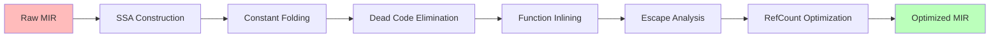

# typhon-mir-optimizer

MIR optimization passes for the Typhon compiler.

This crate transforms raw MIR from `typhon-mir-builder` into optimized SSA-form MIR for code generation, achieving significant performance improvements through dataflow analysis and optimization passes.

## Optimization Pipeline



## Architecture

The crate is organized into the following modules:

- **`error`**: Error types
  - `OptimizerError`: Comprehensive error enum for optimization failures
  - `OptimizerResult`: Result type for optimization operations

- **`config`**: Optimization configuration
  - `OptimizerConfig`: Configuration for optimization levels and pass selection
  - Preset configurations for different optimization levels (0-3)

- **`pass_manager`**: Pass orchestration
  - `PassManager`: Orchestrates execution of optimization passes
  - `OptimizerStats`: Statistics collection for optimization metrics

- **`passes/ssa`**: SSA construction
  - `dominance`: Dominance tree and dominance frontiers computation
  - `phi_insertion`: Phi node insertion at merge points
  - `renaming`: Variable renaming to enforce SSA property

- **`passes`**: Optimization passes (future)
  - `constant_fold`: Constant folding and propagation
  - `dead_code`: Dead code elimination
  - `inline`: Function inlining
  - `escape`: Escape analysis for stack allocation
  - `refcount`: Reference count optimization

- **`analysis`**: Dataflow analysis infrastructure
  - `cfg`: Control flow graph utilities
  - `dominance`: Dominance analysis
  - `liveness`: Liveness analysis
  - `dataflow`: Generic dataflow framework
  - `use_def`: Use-def chain construction

- **`validation`**: Correctness checking
  - `ssa_validator`: SSA form validation
  - `cfg_validator`: Control flow graph validation

## Optimization Strategy

- **SSA Construction**: Transform raw MIR to Static Single Assignment form
  - Compute dominance frontiers using Lengauer-Tarjan algorithm
  - Insert phi nodes at control flow merge points
  - Rename variables to enforce single-assignment property

- **Iterative Optimization**: Run passes until fixed point
  - Constant folding enables dead code elimination
  - Dead code elimination enables more constant folding

- **Analysis-Driven**: Use precise dataflow analysis
  - Dominance analysis for SSA construction
  - Liveness analysis for dead code elimination
  - Escape analysis for memory optimization

## Usage

```rust
use typhon_mir_optimizer::{optimize_module, OptimizerConfig};

// Optimize with default configuration (level 2)
optimize_module(&mut module)?;

// Optimize with custom configuration
let config = OptimizerConfig::level3();
optimize_module_with_config(&mut module, &config)?;
```

## Optimization Levels

- **Level 0**: No optimization
- **Level 1**: Basic (constant folding, DCE)
- **Level 2**: Standard (all optimizations, default)
- **Level 3**: Aggressive (higher iteration count, more inlining)
