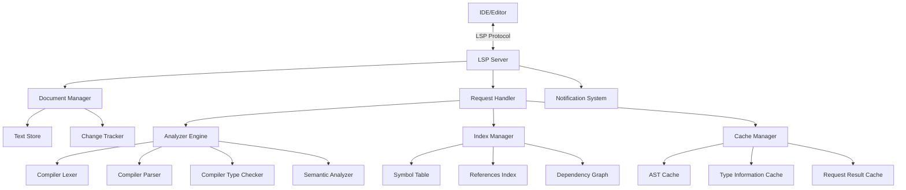
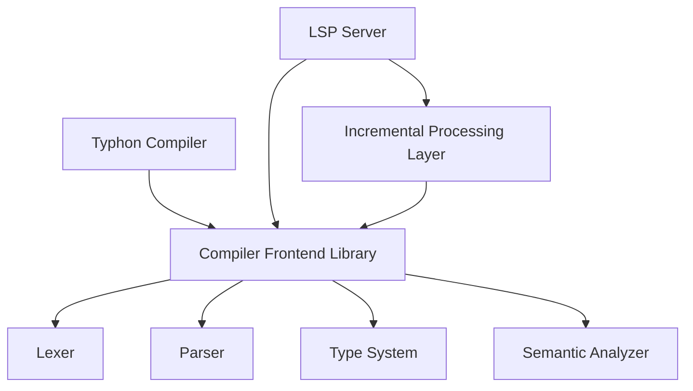
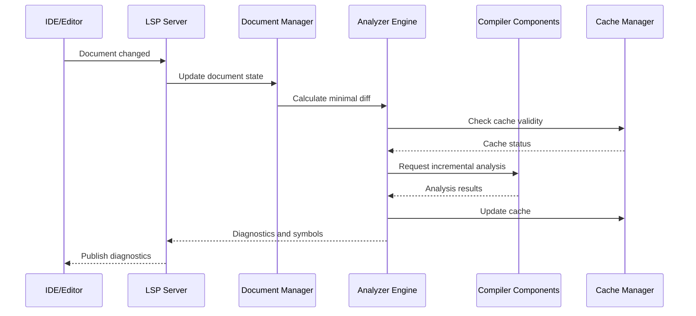

# Typhon Language Server Protocol (LSP) Implementation Plan

## 1. Introduction and Overview

### 1.1 Purpose

This document outlines the comprehensive implementation plan for the Typhon Language Server Protocol (LSP) integration. The LSP will enable modern IDE features for the Typhon programming language, providing developers with rich tooling support including code completion, diagnostics, navigation, and refactoring capabilities.

### 1.2 Background

Typhon is a statically and strongly typed programming language based on Python 3 syntax. It combines Python's elegant syntax with the benefits of static type checking and compiled performance through LLVM. The Typhon compiler is implemented in Rust with a modular architecture consisting of frontend, middle-end, and backend components.

### 1.3 Design Goals

The Typhon LSP implementation aims to achieve the following goals:

- Provide a responsive and accurate development experience
- Maintain consistency with the compiler's behavior
- Support incremental analysis for real-time feedback
- Enable comprehensive IDE features
- Scale effectively with large codebases
- Integrate seamlessly with popular editors and IDEs

## 2. LSP Architecture

### 2.1 Overall Architecture

The Typhon LSP will be implemented as a standalone server that communicates with IDEs via the Language Server Protocol. The architecture consists of these primary components:



### 2.2 Component Descriptions

#### 2.2.1 Document Manager

Responsible for tracking the state of all open documents in the workspace:

- Maintains the current text content of files
- Tracks document versions and changes
- Implements efficient text representation (rope data structure)
- Calculates minimal change sets for incremental analysis

#### 2.2.2 Analyzer Engine

Core component that performs code analysis by reusing compiler frontend components:

- Adapts the compiler's lexer, parser, and type checker for incremental processing
- Performs partial analysis of changed document regions
- Supports speculative analysis for incomplete code
- Implements error recovery mechanisms
- Extracts information needed for LSP features

#### 2.2.3 Index Manager

Maintains cross-document information to support navigation and search features:

- Builds and maintains a global symbol table
- Tracks references between symbols
- Maintains dependency relationships between files
- Supports efficient querying of symbol information
- Implements background indexing of the workspace

#### 2.2.4 Request Handler

Processes LSP requests from the IDE and coordinates responses:

- Dispatches requests to appropriate components
- Manages request prioritization and scheduling
- Implements request cancellation
- Formats responses according to LSP protocol
- Handles error cases and partial results

#### 2.2.5 Notification System

Handles asynchronous notifications to the IDE:

- Publishes diagnostics when files change
- Notifies about workspace changes
- Implements progress reporting for long operations
- Manages telemetry and logging

#### 2.2.6 Cache Manager

Optimizes performance through intelligent caching:

- Implements layered caching strategy
- Manages cache invalidation based on dependencies
- Balances memory usage and performance
- Implements persistence for cross-session performance

## 3. Compiler Integration

### 3.1 Shared Components

The LSP will integrate with the Typhon compiler by sharing these key components:

- **Lexer**: Tokenizes source code with source position tracking
- **Parser**: Produces AST compatible with Python's structure
- **Type System**: Provides type checking and inference
- **Semantic Analyzer**: Validates language rules and constraints

### 3.2 Adaptation for Incremental Processing

To support real-time analysis, compiler components require adaptation:

#### 3.2.1 Lexer Adaptation

- Modify to accept partial text ranges
- Enhance error recovery for incomplete tokens
- Add state serialization for resuming lexing

#### 3.2.2 Parser Adaptation

- Implement incremental parsing capabilities
- Enhance error recovery to continue past errors
- Preserve partially correct AST nodes
- Support speculative parsing for incomplete constructs

#### 3.2.3 Type Checker Adaptation

- Implement fine-grained dependency tracking
- Support partial type environments
- Add incremental type checking capabilities
- Enhance error recovery to continue analysis with uncertain types

#### 3.2.4 AST Handling

- Design efficient AST representation for partial updates
- Implement AST diffing to identify changed nodes
- Develop node replacement strategies that minimize invalidation

### 3.3 Architecture Modifications



Key architectural changes:

1. Extract compiler frontend components into a shared library
2. Add abstraction layers for incremental processing
3. Create adapter interfaces between LSP and compiler components
4. Ensure thread-safety for concurrent access
5. Implement version control for synchronized compiler updates

### 3.4 Data Flow Between Components



This sequence diagram illustrates the flow of data during a document change event, showing how the LSP server processes changes incrementally and coordinates with compiler components.

## 4. LSP Feature Implementation

### 4.1 Core Features

#### 4.1.1 Diagnostics

- **Syntax Errors**: Provide error messages with precise locations
- **Type Errors**: Report type mismatches and constraints violations
- **Semantic Errors**: Identify issues with scopes, visibility, etc.
- **Unused Code**: Detect unused variables, imports, and functions
- **Flow Analysis**: Report unreachable code and non-exhaustive pattern matching

Implementation approach:

- Collect errors during parsing and type checking
- Convert compiler errors to LSP diagnostic format
- Group related errors for better presentation
- Implement severity levels (error, warning, info)
- Provide suggested fixes where applicable

#### 4.1.2 Code Completion

- **Variable and Function Names**: Complete local and global identifiers
- **Class Members**: Complete fields and methods with dot notation
- **Import Statements**: Complete module and symbol names
- **Type Annotations**: Complete type names and parameters
- **Function Parameters**: Complete parameter names with types

Implementation approach:

- Extract completion candidates from symbol tables
- Use fuzzy matching for partial identifiers
- Apply context-sensitive filtering
- Provide type information in completion items
- Support snippet-based completion for complex constructs

#### 4.1.3 Hover Information

- **Type Information**: Show types of variables and expressions
- **Documentation**: Display docstrings and comments
- **Signature Help**: Show function parameters and types
- **References**: Indicate usage count and locations
- **Value Hints**: Show constant values where applicable

Implementation approach:

- Extract type information from the type checker
- Resolve symbol documentation from source
- Format information with Markdown
- Include links to related symbols
- Show examples where relevant

#### 4.1.4 Navigation

- **Go to Definition**: Navigate to symbol declarations
- **Find References**: Locate all usages of a symbol
- **Go to Implementation**: Navigate to protocol implementations
- **Document Symbols**: Provide structural outline of the file
- **Workspace Symbols**: Search symbols across workspace

Implementation approach:

- Use index manager to resolve symbol locations
- Track symbol references during analysis
- Build hierarchical symbol representations
- Implement efficient symbol search algorithms
- Update symbol information incrementally

### 4.2 Advanced Features

#### 4.2.1 Refactoring Support

- **Rename**: Rename symbols across files
- **Extract Function/Variable**: Extract code into new declarations
- **Add Type Annotations**: Infer and add missing annotations
- **Import Management**: Add, remove, and organize imports
- **Implement Protocol**: Generate stub methods for protocols

Implementation approach:

- Implement precise source manipulation
- Verify refactoring safety with compiler analysis
- Preview changes before applying
- Support transaction-like operations
- Handle multi-file changes atomically

#### 4.2.2 Code Actions

- **Quick Fixes**: Provide solutions for common errors
- **Code Transformations**: Offer style and pattern improvements
- **Type Specialization**: Convert generic code to specific types
- **Code Generation**: Generate boilerplate and repetitive code
- **Organization**: Improve code structure and formatting

Implementation approach:

- Analyze diagnostic context for applicable fixes
- Implement transformation templates
- Use type information to guide transformations
- Ensure correctness with compiler validation
- Provide clear descriptions of actions

#### 4.2.3 Code Formatting

- **Document Formatting**: Format entire documents
- **Range Formatting**: Format selected code regions
- **On-Type Formatting**: Format as user types
- **Configuration**: Support customizable formatting rules

Implementation approach:

- Implement Typhon-specific formatter
- Consider integration with standard formatters
- Preserve semantics during formatting
- Support style configuration
- Handle comments and multi-line constructs

#### 4.2.4 Workspace Features

- **Workspace Symbols**: Global symbol search
- **Project-wide Refactoring**: Cross-file transformations
- **Find References**: Locate symbol usages across files
- **Dependency View**: Visualize module dependencies
- **Type Hierarchy**: Show class and protocol relationships

Implementation approach:

- Build and maintain workspace index
- Implement efficient cross-file analysis
- Schedule background processing for large workspaces
- Cache results for performance
- Support incremental updates on file changes

### 4.3 Feature Priority Matrix

| Feature            | Priority | Complexity | Dependencies                          |
| ------------------ | -------- | ---------- | ------------------------------------- |
| Diagnostics        | High     | Medium     | Lexer, Parser, Type Checker           |
| Code Completion    | High     | High       | Parser, Type Checker, Symbol Table    |
| Hover Information  | High     | Medium     | Type Checker, Documentation Parser    |
| Go to Definition   | High     | Medium     | Symbol Table, References Index        |
| Find References    | Medium   | High       | References Index, Dependency Graph    |
| Document Symbols   | High     | Low        | Parser, Symbol Table                  |
| Workspace Symbols  | Medium   | Medium     | Symbol Table, Index Manager           |
| Rename Refactoring | Medium   | High       | References Index, Source Manipulation |
| Quick Fixes        | Medium   | Medium     | Diagnostics, Source Manipulation      |
| Code Formatting    | Low      | Medium     | Parser, Style Configuration           |
| Type Hierarchy     | Low      | High       | Type System, Symbol Table             |

## 5. Implementation Approach in Rust

### 5.1 Project Structure

```shell
typhon_lsp/
├── src/
│   ├── main.rs               # Server entry point
│   ├── server.rs             # LSP server implementation
│   ├── document.rs           # Document manager
│   ├── analyzer/             # Analysis engine
│   │   ├── mod.rs
│   │   ├── incremental.rs    # Incremental analysis
│   │   └── adapter.rs        # Compiler adapter
│   ├── index/                # Symbol indexing
│   │   ├── mod.rs
│   │   ├── symbols.rs        # Symbol table
│   │   └── references.rs     # Reference tracking
│   ├── features/             # LSP feature implementations
│   │   ├── mod.rs
│   │   ├── completion.rs
│   │   ├── diagnostics.rs
│   │   ├── hover.rs
│   │   └── ... (other features)
│   ├── cache/                # Caching system
│   │   ├── mod.rs
│   │   └── strategy.rs       # Cache strategies
│   └── util/                 # Utilities
│       ├── mod.rs
│       └── rope.rs           # Text representation
└── tests/                    # Test cases
    ├── integration/          # Integration tests
    └── features/             # Feature-specific tests
```

### 5.2 Key Dependencies

- **tower-lsp**: Core LSP protocol implementation
- **tokio**: Async runtime for handling concurrent requests
- **ropey**: Rope data structure for efficient text manipulation
- **salsa**: Incremental computation framework
- **dashmap**: Thread-safe concurrent maps
- **serde_json**: JSON serialization for LSP messages
- **log/env_logger**: Logging infrastructure
- **lsp-types**: LSP protocol data structures

### 5.3 Design Patterns

#### 5.3.1 Trait-based Architecture

```rust
// Example of trait-based design
trait SymbolProvider {
    fn find_symbol_at_position(&self, uri: &Url, position: Position) -> Option<Symbol>;
    fn get_all_symbols(&self, uri: &Url) -> Vec<Symbol>;
}

struct TypeCheckerSymbolProvider<'a> {
    type_checker: &'a TypeChecker,
    // ...
}

impl<'a> SymbolProvider for TypeCheckerSymbolProvider<'a> {
    // Implementation using the type checker
}

// Alternative implementation for testing
struct MockSymbolProvider {
    // ...
}

impl SymbolProvider for MockSymbolProvider {
    // Test implementation
}
```

#### 5.3.2 Query-based Incremental Computation

```rust
#[salsa::query_group(AnalysisDatabase)]
trait AnalysisQueries: salsa::Database {
    #[salsa::input]
    fn source_text(&self, file_id: FileId) -> Arc<String>;

    fn parsed_ast(&self, file_id: FileId) -> Arc<Ast>;

    fn resolved_types(&self, file_id: FileId) -> Arc<TypeMap>;

    fn diagnostics(&self, file_id: FileId) -> Vec<Diagnostic>;
}

fn parsed_ast(db: &dyn AnalysisQueries, file_id: FileId) -> Arc<Ast> {
    let text = db.source_text(file_id);
    // Parse the text and return AST
}

fn resolved_types(db: &dyn AnalysisQueries, file_id: FileId) -> Arc<TypeMap> {
    let ast = db.parsed_ast(file_id);
    // Type check the AST and return type map
}

fn diagnostics(db: &dyn AnalysisQueries, file_id: FileId) -> Vec<Diagnostic> {
    let ast = db.parsed_ast(file_id);
    let types = db.resolved_types(file_id);
    // Collect diagnostics from parsing and type checking
}
```

#### 5.3.3 Actor Model for Concurrency

```rust
struct AnalysisActor {
    receiver: mpsc::Receiver<AnalysisRequest>,
    // ...
}

impl AnalysisActor {
    async fn run(&mut self) {
        while let Some(request) = self.receiver.recv().await {
            match request {
                AnalysisRequest::Analyze { uri, version, sender } => {
                    let result = self.analyze(uri, version).await;
                    let _ = sender.send(result);
                }
                AnalysisRequest::Cancel { id } => {
                    self.cancel(id);
                }
                // Other request types
            }
        }
    }
}

// In the main server
let (tx, rx) = mpsc::channel(100);
let mut actor = AnalysisActor::new(rx);
tokio::spawn(async move {
    actor.run().await;
});

// Send request
let (response_tx, response_rx) = oneshot::channel();
tx.send(AnalysisRequest::Analyze {
    uri: document_uri.clone(),
    version: document_version,
    sender: response_tx,
}).await?;
let result = response_rx.await?;
```

### 5.4 Error Handling Strategy

- Use `Result` types consistently for error propagation
- Define LSP-specific error types with conversion to protocol errors
- Implement error recovery for partial analysis
- Provide detailed error context for debugging
- Add telemetry for detecting common error patterns

### 5.5 Thread Safety Considerations

- Use thread-safe data structures (Arc, Mutex, RwLock)
- Implement actor model for stateful components
- Use message passing for cross-thread communication
- Design immutable data structures where possible
- Use explicit synchronization points for mutable state

## 6. Testing Strategy

### 6.1 Unit Testing

- Test individual components in isolation
- Use mock implementations for dependencies
- Test error handling and edge cases
- Verify correct behavior with different inputs
- Test concurrent access patterns

Example test structure:

```rust
#[cfg(test)]
mod tests {
    use super::*;

    #[test]
    fn test_completion_provider_local_variables() {
        let mut mock_analyzer = MockAnalyzer::new();
        mock_analyzer.add_local_variable("test_var", "int");

        let provider = CompletionProvider::new(mock_analyzer);
        let completions = provider.provide_completions("test", Position::new(1, 2));

        assert_eq!(completions.len(), 1);
        assert_eq!(completions[0].label, "test_var");
        assert_eq!(completions[0].detail, Some("int".to_string()));
    }

    #[test]
    fn test_diagnostics_syntax_error() {
        // Test syntax error diagnostics
    }

    // More tests...
}
```

### 6.2 Integration Testing

- Test interactions between components
- Verify LSP protocol compliance
- Test complete feature workflows
- Use snapshot testing for complex outputs
- Test with real compiler components

Example integration test:

```rust
#[tokio::test]
async fn test_complete_hover_flow() {
    let (client, server) = LspTestHarness::new();

    // Initialize server
    client.initialize().await;

    // Open document
    client.open_document("test.ty", "def add(a: int, b: int) -> int:\n    return a + b");

    // Request hover
    let hover = client.hover("test.ty", Position::new(0, 5)).await;

    assert!(hover.is_some());
    let contents = hover.unwrap().contents;
    assert!(contents.to_string().contains("function add"));
    assert!(contents.to_string().contains("(a: int, b: int) -> int"));
}
```

### 6.3 Protocol Conformance Testing

- Test against LSP specification
- Verify correct handling of LSP messages
- Test initialization and shutdown sequences
- Verify handling of malformed requests
- Test version negotiation

### 6.4 Feature Testing

- Create comprehensive test suite for each feature
- Test with valid and invalid inputs
- Verify correct behavior with edge cases
- Test feature interactions
- Include complex real-world examples

### 6.5 Performance Testing

- Benchmark response times for different operations
- Test memory usage patterns
- Measure scaling with large files and projects
- Profile CPU usage during typical operations
- Test cache effectiveness

### 6.6 Continuous Integration

- Run tests on each commit
- Include performance regression tests
- Test on different platforms
- Generate test coverage reports
- Integrate with code quality tools

## 7. Performance Considerations

### 7.1 Incremental Analysis

The key to LSP performance is efficient incremental analysis:
